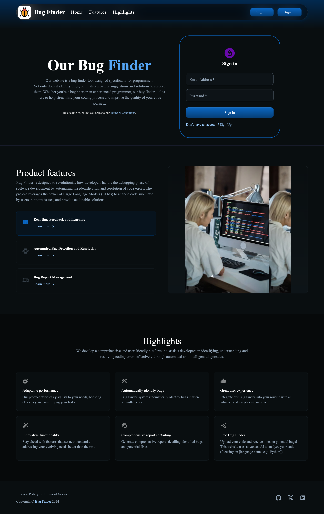
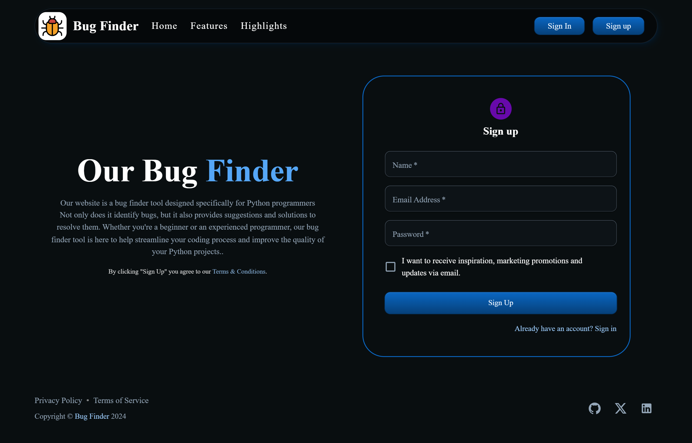
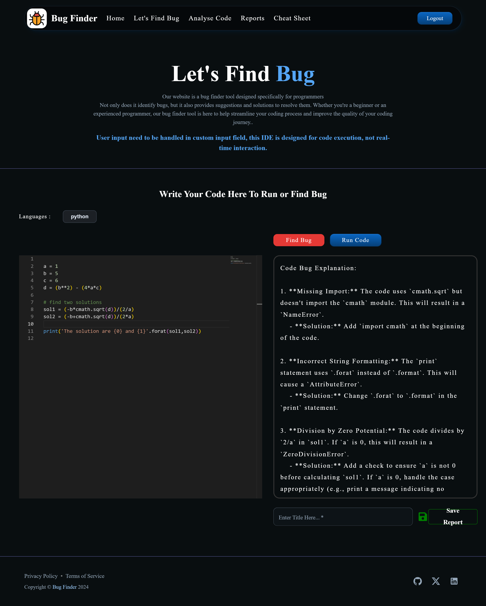
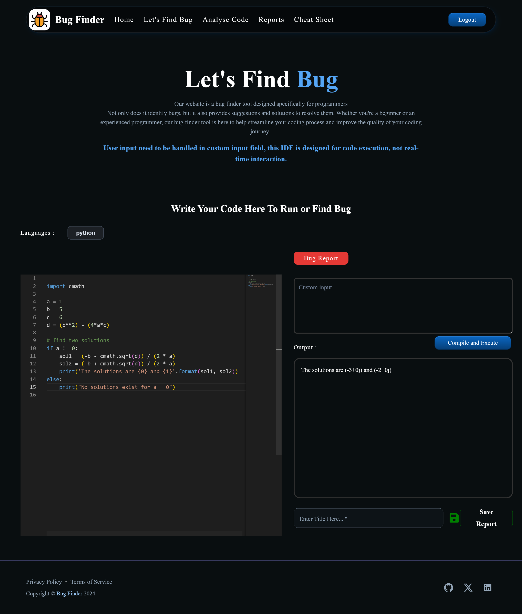
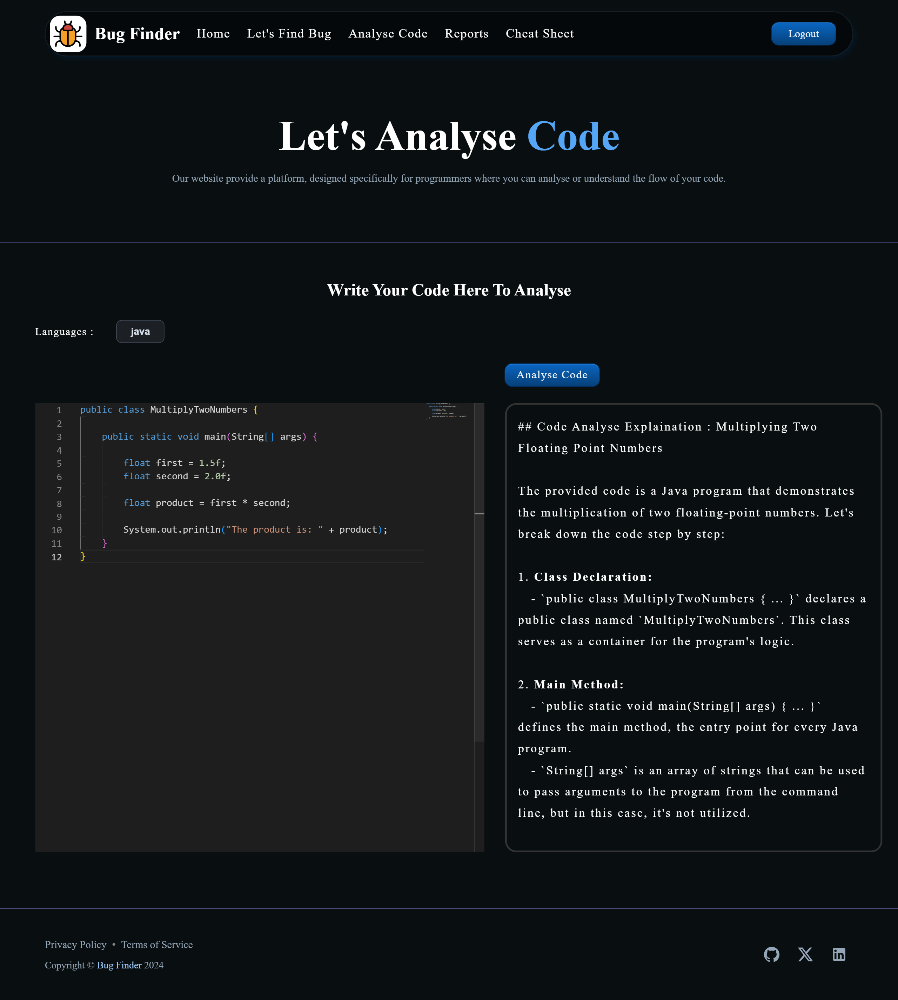
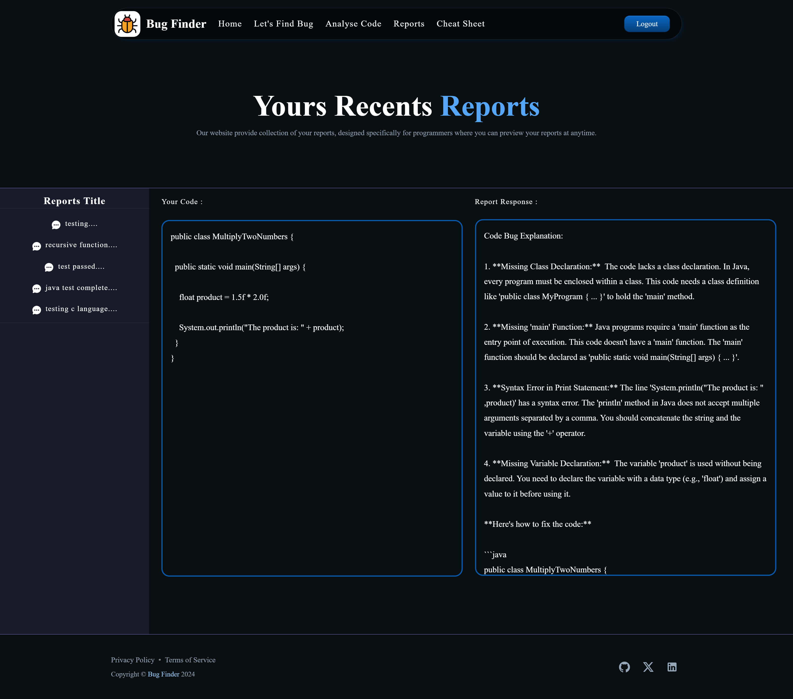
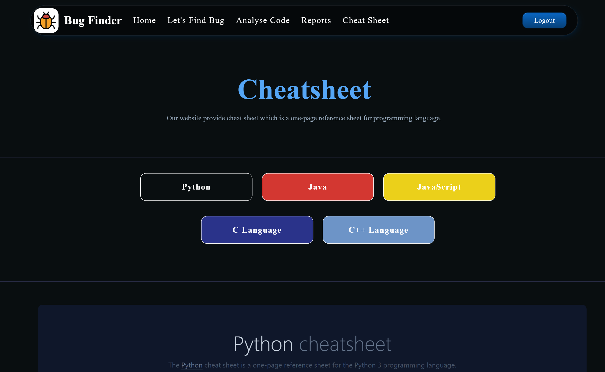

# Bug Finder System

## Introduction
The **Bug Finder System** is a web-based application designed to assist users in identifying and resolving bugs in their code. The system leverages Large Language Models (LLMs), specifically Google Gemini, to analyze uploaded code, detect errors, and provide actionable debugging insights. It is designed for developers of all skill levels, offering an efficient, automated debugging process to reduce time spent on identifying and fixing coding errors.

## Features
- **User-Friendly Interface**: Easy-to-navigate platform where users can upload their code for analysis.
- **Automated Bug Detection**: Integration with Google Gemini API for advanced code diagnostics.
- **Multiple Language Support**: Supports debugging for languages such as Python, C++, JavaScript, Java, and C.
- **Cheat Sheets**: Learning resources for various programming languages to assist novice developers.
- **Detailed Reporting**: Generates and saves comprehensive bug reports for the submitted code.
- **Real-Time Feedback**: Provides real-time suggestions for code fixes.

## Technologies Used
### Frontend:
   - : - Builds dynamic and responsive user interfaces.

### Backend:
 - : - Manages the backend, handling user requests and data flow.

 - : - Used for code analysis and debugging.

### Database:
 - : - Stores user code submissions and debugging reports.

## Usage
1. **Sign Up/Sign In**: Users need to create an account or log in.
2. **Upload Code**: Users can upload their code for analysis via the platform.
3. **Code Analysis**: The system runs code diagnostics using the Google Gemini API and generates detailed reports.
4. **View Reports**: Users can view and download reports with suggestions on bug fixes.
5. **Cheat Sheets**: Access cheat sheets for supported programming languages to help with coding best practices.

## Screenshots

### Landing-Page

### Home-Page 

### FindBug-Page 

### RunCode-Section(FindBug-Page) 

### AnalyseCode-Page 

### AnalyseCode-Page 

### Report-Page 

### CheatSheet-Page 

-----------------------------------------------------------------------------------------------------------------------------
<h3 align="center">Hi there😄</h3>

**You Can use this Beautiful Project for your college Project and get good marks too.**

Email me Now **yadavdhiru201@gmail.com** to get this Full Project Code, PPT, Report of this Project.
 
### HOW TO RUN THE PROJECT-
⚡ Email me at **yadavdhiru201@gmail.com** to get a detailed Guide report with Code to run the project with source Code.

### Need Code, Documents & Explanation video ? 

## How to Reach me :

### Mail : yadavdhiru201@gmail.com 

### WhatsApp: **+977 9803403860** (Helping 24*7) 

### Website : https://www.dhirajyadav.com.np

Mail/Message me for Projects Help 🙏🏻

## License
This project is licensed under the MIT License - see the [LICENSE](LICENSE) file for details.
This README file provides a comprehensive overview of the Bug Finder System project, including details on installation, usage, features, and.
